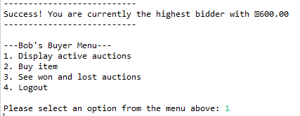
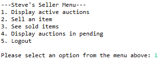
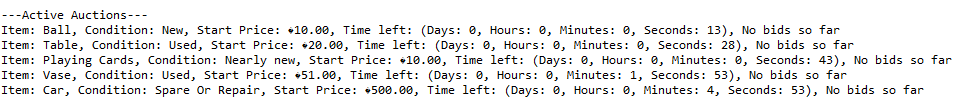
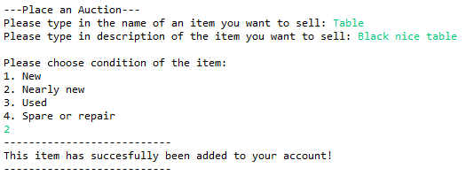
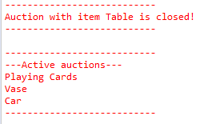

# eAuction-System-Java

 eAuction system is a program built with Java programming language, with use of the best practices and it is consol based application. 
 The whole system was written in accordance with Object-Oriented programming paradigm, and even though it is consol based application, it can be easily embedded in any other environment.
 
 eAuction system is a typical system with auctions where the registered users can buy and sell various items by a bidding system.
 The whole system is based on multithreading and concurrency, so multiple auctions are going on in the background.
 There are some initially registered users who are saved in serialized file where the objects are represented by a sequence of bytes, and it is deserialized and loaded in at every start of the application.
 The registration of the new users is pretty basic, but it allows to register new accounts and to choose their role in the system; everyone can choose between buyer and seller.
 
 Each item in the system is assigned to a seller initially, and it can be put on an auction with parameters such as price, reserve price, and closing date and time.
 All the users are informed about the expiring auctions as well as auctions that are still active. 
 
 There also is admin is capable of changing the duration of thread sleep that is responsible for checking the status of auctions as well as blocking ongoing auctions and sellers. 
 
## List of registered users

Buyers:
- Username: Bob, Password: 123
- Username: Bikl, Password: 123
- Username: Ben, Password: 123

Sellers:
- Username: Steve, Password: 123
- Username: Simon, Password: 123

Admin:
- Username: Glyn, Password: 123a

# Screenshots of the consol application
</img>
</img>
</img>
</img>
</img>
